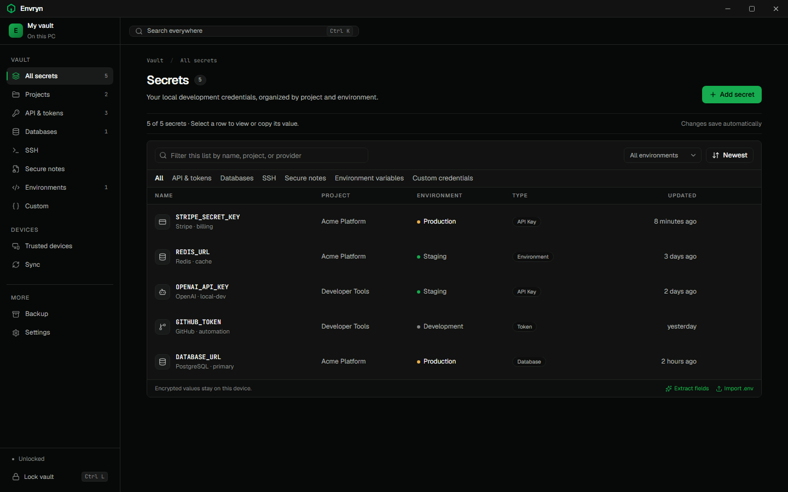
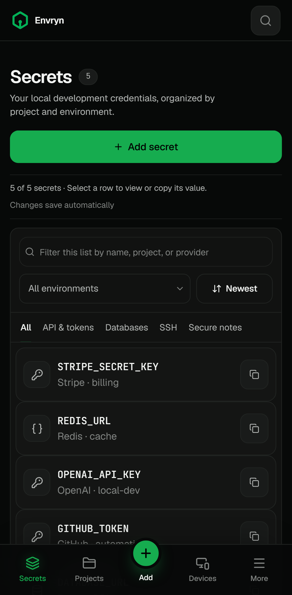
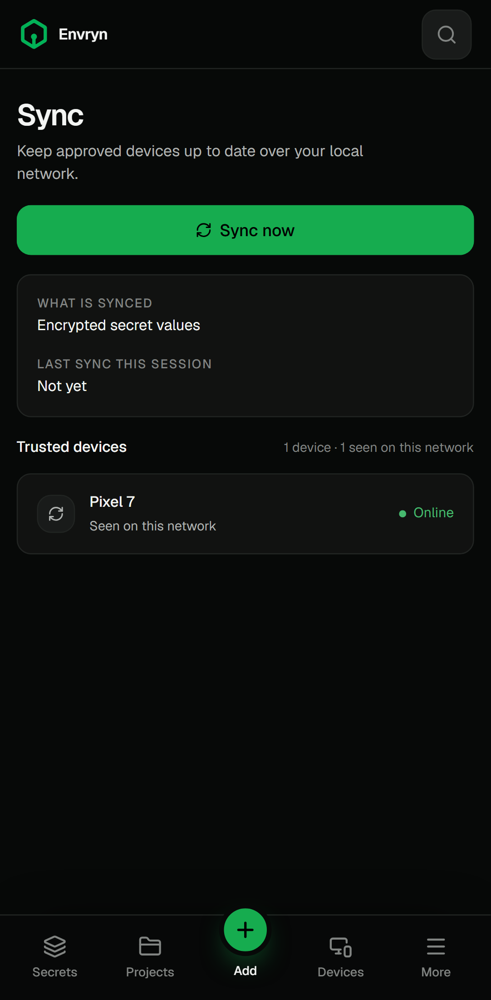

<div align="center">


# Envryn

**A private, local-first secrets vault for developers.**

Keep API keys, tokens, database credentials, SSH keys, and secure notes encrypted on your own devices. No account. No cloud vault. No telemetry.

[](https://github.com/Gr33nOps/Envryn/actions/workflows/ci.yml)
[](https://github.com/Gr33nOps/Envryn/security/code-scanning)
[](https://github.com/Gr33nOps/Envryn/releases)
[](LICENSE)
[](#install)
[](#install)

[Download](https://github.com/Gr33nOps/Envryn/releases) · [Security](.github/SECURITY.md) · [Documentation](docs/README.md) · [Contributing](CONTRIBUTING.md)

</div>

## See Envryn in action

<table>
  <tr>
    <td width="58%"></td>
    <td width="21%"></td>
    <td width="21%"></td>
  </tr>
  <tr>
    <td align="center"><strong>Desktop vault</strong></td>
    <td align="center"><strong>Mobile vault</strong></td>
    <td align="center"><strong>Local sync</strong></td>
  </tr>
</table>

The gallery uses fabricated metadata created by the repeatable screenshot test. No real credentials appear in these images.

## Why Envryn

`.env` files are convenient, but they are easy to commit, copy, or leave behind. Cloud secrets managers solve part of that problem by asking you to trust another service with your credentials. Envryn takes a different path:

- **Your vault stays local.** The encrypted vault file lives on your device.
- **Sync is direct.** Approved devices sync over your local network without a relay server.
- **There is no account.** Envryn does not need an email address, subscription, or hosted control plane.
- **Security decisions live in Rust.** The interface never gets to bypass vault policy.
- **Optional AI stays local.** The Windows app can run a small on-device model, and the vault works fully without it.
- **The limits are documented.** Envryn is beta software and has not received an independent third-party audit.

## What it can do

- Store API keys, tokens, environment variables, database credentials, SSH keys, OAuth secrets, webhooks, and notes
- Organize secrets by project and Development, Staging, or Production environment
- Detect many common credential formats without a network request
- Import `.env` content and extract structured fields
- Pair Windows and Android devices with a human-verified code
- Sync encrypted records directly over the local network
- Create encrypted, password-protected backups
- Lock on idle or when the Android app moves to the background
- Clear copied secrets after a configurable delay
- Unlock with Windows Hello when platform protection is enabled

## Security at a glance

Envryn uses:

- XChaCha20-Poly1305 authenticated encryption for vault records
- Argon2id for master-password key derivation
- HKDF-SHA256 for domain-separated subkeys
- Mutually authenticated TLS for paired-device sync
- Windows DPAPI for optional platform protection
- Android screenshot blocking, backup blocking, and sensitive clipboard labels

Security claims are backed by unit tests, integration tests, browser journeys, accessibility checks, fuzz targets, CodeQL, SonarQube Cloud, Semgrep, Gitleaks, OSV-Scanner, `cargo-audit`, `cargo-deny`, and npm audit.

Start with the [threat model](docs/THREAT_MODEL.md), [cryptography notes](docs/CRYPTOGRAPHY.md), and [security testing guide](docs/SECURITY_TESTING.md). To report a vulnerability, read the [security policy](.github/SECURITY.md) and use GitHub private vulnerability reporting.

## Install

Download the newest beta from [GitHub Releases](https://github.com/Gr33nOps/Envryn/releases).

### Windows

Choose either installer:

- `Envryn_<version>_x64-setup.exe` for the usual setup experience
- `Envryn_<version>_x64_en-US.msi` for Windows Installer deployments

Both install the same application. Windows packages are not code-signed yet, so SmartScreen may show an unknown publisher warning. Verify the file against `CHECKSUMS.txt` before running it.

### Android

Install `Envryn_<version>_android-universal.apk` on Android 10 or newer. Android will ask you to allow installation from an unknown source because Envryn is distributed directly through GitHub.

The Android APK is signed with the same Envryn release identity across updates. Android does not include the optional local AI worker.

### Verify a download

On PowerShell:

```powershell
Get-FileHash .\Envryn_<version>_x64-setup.exe -Algorithm SHA256
```

Compare the result with the matching entry in the release's `CHECKSUMS.txt`. Release downloads also include a CycloneDX software bill of materials.

## Update or uninstall

Envryn does not update itself in the `0.1.x` beta series. Download a newer installer from this repository and install it over the existing version. Your vault is stored separately and remains in place.

Uninstalling the app does not delete your vault. This protects users from losing secrets during an uninstall or reinstall.

To remove the Windows vault data too:

1. Uninstall Envryn.
2. Press `Win+R`, enter `%APPDATA%`, and remove `dev.envryn.vault`.
3. Optionally remove `%LOCALAPPDATA%\dev.envryn.vault`, which contains WebView cache data rather than vault secrets.

Read [the update policy](docs/UPDATE_POLICY.md) for the reasoning and recovery guidance.

## Build from source

### Prerequisites

- Node.js 20 or newer
- Rust stable
- Windows with the [Tauri prerequisites](https://tauri.app/start/prerequisites/)
- Android Studio and the Android SDK for Android builds

```powershell
git clone https://github.com/Gr33nOps/Envryn.git
cd Envryn
npm ci
npm run tauri:dev
```

Useful checks:

```powershell
cargo test --workspace
cargo clippy --workspace --all-targets --all-features -- -D warnings
npm run lint
npm run typecheck
npm run test:coverage --workspace @envryn/ui
npm run test:e2e
npm run test:bundle-budget
npm run test:security-invariants
npm run screenshots:readme
```

The repository includes pre-commit and pre-push hooks under `.githooks/`. See [CONTRIBUTING.md](CONTRIBUTING.md) for setup and pull request expectations.

## Architecture

```text
apps/ui/             React and TanStack Router interface
crates/envryn-core/  Vault, cryptography, storage, sync, and platform policy
crates/envryn-ai-worker/
                     Optional local inference process with no vault dependency
src-tauri/            Tauri commands and native application shell
packages/contract/   TypeScript bindings generated from Rust IPC types
```

The UI is treated as untrusted. Sensitive operations cross a typed Tauri boundary and are enforced by the Rust core. The local AI worker runs as a separate process and receives only the minimum sanitized input for a requested operation.

Read [the architecture guide](docs/ARCHITECTURE.md) for data flows and design decisions.

## Documentation

- [Documentation index](docs/README.md)
- [Architecture](docs/ARCHITECTURE.md)
- [Cryptography](docs/CRYPTOGRAPHY.md)
- [Threat model](docs/THREAT_MODEL.md)
- [Security invariants](docs/SECURITY_INVARIANTS.md)
- [Security and privacy testing](docs/SECURITY_TESTING.md)
- [Quality testing](docs/QUALITY_TESTING.md)
- [Dependency policy](docs/DEPENDENCY_POLICY.md)
- [AI security](docs/AI_SECURITY.md)
- [AI data access](docs/AI_DATA_ACCESS.md)
- [Release process](docs/RELEASE_PROCESS.md)

## Project status

Envryn is in beta. The core vault, backup, sync protocol, Windows app, and Android app are functional and tested. Important limitations remain:

- Windows installers do not have a trusted publisher signature yet.
- Android has less physical-device coverage than Windows.
- The local AI feature is optional and intentionally uses a small model.
- There is no automatic updater.
- The project has completed an internal security review, not an independent audit.

If you find a bug, [open an issue](https://github.com/Gr33nOps/Envryn/issues/new/choose). If you want to help, read [CONTRIBUTING.md](CONTRIBUTING.md).

## License

Envryn is available under the [MIT License](LICENSE).
